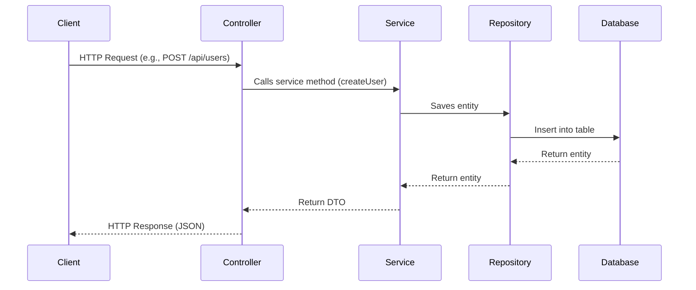

# Spring Boot REST API Template 🚀

A **production-ready Spring Boot REST API template** with DTOs, Controllers, Repositories, Services, and Mappers.
This repository is meant to be a **starter kit / building block** for creating scalable REST APIs with Spring Boot.

---

## 📌 Features

* ✅ Layered architecture (Controller → Service → Repository → Model → DTO → Mapper)
* ✅ Pre-configured DTOs for request & response
* ✅ RESTful API design principles
* ✅ Example entity (`User`) included
* ✅ Ready-to-use for **CRUD operations**
* ✅ Easily extendable for new entities
* ✅ Maven-based project structure

---

## 🗂️ Project Structure

```
src/main/java/com/yourpackage/demo
│── controller/        # REST Controllers
│── dto/               # Request & Response DTOs
│── model/             # Entity models
│── repository/        # JPA Repositories
│── service/           # Business logic layer
│── mapper/            # DTO ↔ Entity mappers
│── DemoApplication.java  # Main Spring Boot application
```

---

## ⚡ Getting Started

### 1️⃣ Clone the repo

```bash
git clone https://github.com/your-username/spring-boot-restapi-template.git
cd spring-boot-restapi-template
```

### 2️⃣ Build & Run

Make sure you have **Java 17+** and **Maven** installed.

```bash
mvn spring-boot:run
```

The application will start at:

```
http://localhost:8080/Users
```

---

## 🔑 Example API Endpoints

### Create User

```http
POST /api/users
Content-Type: application/json

{
  "name": "John Doe",
  "email": "john@example.com"
}
```

### Get All Users

```http
GET /api/users
```

### Get User By ID

```http
GET /api/users/{id}
```

### Update User

```http
PUT /api/users/{id}
Content-Type: application/json

{
  "name": "Updated Name",
  "email": "updated@example.com"
}
```

### Delete User

```http
DELETE /api/users/{id}
```

---

## 🛠️ Tech Stack

* **Java 17+**
* **Spring Boot 3.x**
* **Spring Data JPA (Hibernate)**
* **Maven**
* **H2/PostgreSQL/MySQL** (configurable)

---

## 🖼️ Request Flow (Sequence Diagram)



---

## 📖 How to Extend

1. Create a new **Entity** in `model/`
2. Add a **Repository** in `repository/`
3. Add **DTOs** in `dto/`
4. Add a **Mapper** in `mapper/`
5. Add **Service layer** in `service/`
6. Add a **Controller** in `controller/`

That’s it — your new REST API endpoint is ready! 🚀

---

## 🤝 Contributing

Feel free to fork this repo, create a new branch, and submit a PR with improvements.
Suggestions and improvements are welcome!

---

## 📜 License

This project is licensed under the **MIT License** – you are free to use it for personal and commercial purposes.

---

👨‍💻 Created with ❤️ by [ShubhamSharma025](https://github.com/ShubhamSharma025)
